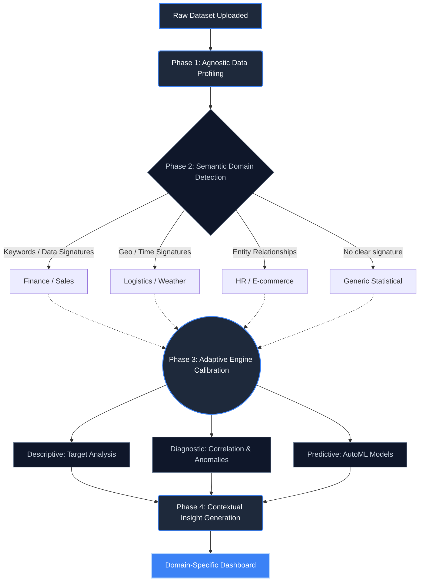

# Dynamic Multi-Domain Analysis Flow

From the perspective of a seasoned Data Analyst, working with unknown data requires a system that doesn't just run static operations, but dynamically adapts its approach based on the "Domain Context" (e.g., Finance, Healthcare, E-commerce, Weather).

To achieve a true **Dynamic, Adaptable, and Multi-use** analytical engine, the flow must mimic human analytical reasoning:

1. **Observe** (Profile the raw shapes)
2. **Contextualize** (Determine the domain)
3. **Adapt** (Choose the right analytical tools for the context)
4. **Synthesize** (Generate insights that speak the domain's language)

Here is the architectural workflow for building this system.

---

## The Dynamic Analysis Flow Architecture

---

## Phase 1: Agnostic Data Profiling (The "First Glance")

Before we know _what_ the data is about, we need to know its _physical_ characteristics. This phase treats all data equally.

- **Type Inference:** Are columns numerical, categorical, temporal, or spatial?
- **Sparsity & Quality:** Are there nulls? Are there extreme outliers indicating bad data collection?
- **Cardinality:** Does a column have many unique values (like IDs) or few (like categories)?

**Why it's adaptable:** This phase never breaks, regardless of the data topic, ensuring the system can ingest anything.

---

## Phase 2: Semantic Domain Detection (The "Contextualizer")

This is where the system becomes "smart". A good analyst looks at column headers and data samples and immediately knows: _"Ah, 'Close_Price' and 'Volume' means this is Stock data."_

- **Heuristic Matching:** Scanning columns for keywords (`revenue`, `patient_id`, `temperature_c`).
- **Signature Recognition:** Recognizing that a dataset with `Latitude`, `Longitude`, and a `Timestamp` is inherently Geospatial/Mobility data.
- **Domain Ontology:** Mapping detected keywords to predefined domain categories (Finance, HR, Healthcare, E-commerce, Weather, Generic).

---

## Phase 3: Adaptive Engine Calibration (The "Multi-use Core")

Once the domain is known, the system **adapts** its statistical approach. An analyst doesn't treat stock prices (time-series volatility) the same way they treat a customer satisfaction survey (categorical distribution).

### Dynamic Logic Pathways:

- **If Domain == Finance / Time-Series:**
  - _Focus on:_ Trends over time, Moving Averages, Volatility (Standard Deviation), Seasonality.
  - _Target Variable logic:_ Automatically look for the column representing "Money" or "Price".
- **If Domain == E-Commerce / Consumer:**
  - _Focus on:_ Segmentation, Pareto Analysis (80/20 rule), Churn probability, Basket Analysis.
  - _Target Variable logic:_ Look for "Conversion", "Sales", or "Retention".
- **If Domain == Generic (Unknown):**
  - fall back to robust, agnostic statistics (Distribution shapes, basic correlation matrices, PCA for dimensionality reduction).

---

## Phase 4: Contextual Insight Generation (The "Storyteller")

Data is useless without translation. A generic system says: _"Variable X increased by 40% while Y decreased by 12%."_
A **Domain-Adapted** system uses an LLM (Large Language Model) overlay to speak the user's language.

- **Dynamic Prompting:** The system passes the raw statistics _and_ the detected Domain to the AI.
  - _Finance Prompt:_ "Act as a CFO. Explain these variance metrics..."
  - _HR Prompt:_ "Act as an HR Director. Explain these attrition correlations..."
- **Resulting Output:**
  - _"We observed a 40% surge in Customer Acquisition Cost (Variable X), directly driving down Net Retention (Variable Y) by 12%."_

## How to Implement this in Code (The Analyst's Playbook)

To build this practically, your software architecture should use a **Strategy Pattern**:

1. **A Base `Analyzer` Class:** Handles parsing, cleaning, and basic math.
2. **Domain Strategies:** Classes like `FinanceAnalyzer`, `HealthcareAnalyzer` that inherit from the Base Class but override specific methods (e.g., overriding `select_target_variable()` to hunt for dollar amounts).
3. **The Orchestrator:** A central controller that runs Phase 1 & 2, instantiates the correct specific Analyzer, and pipelines the output to the UI.
